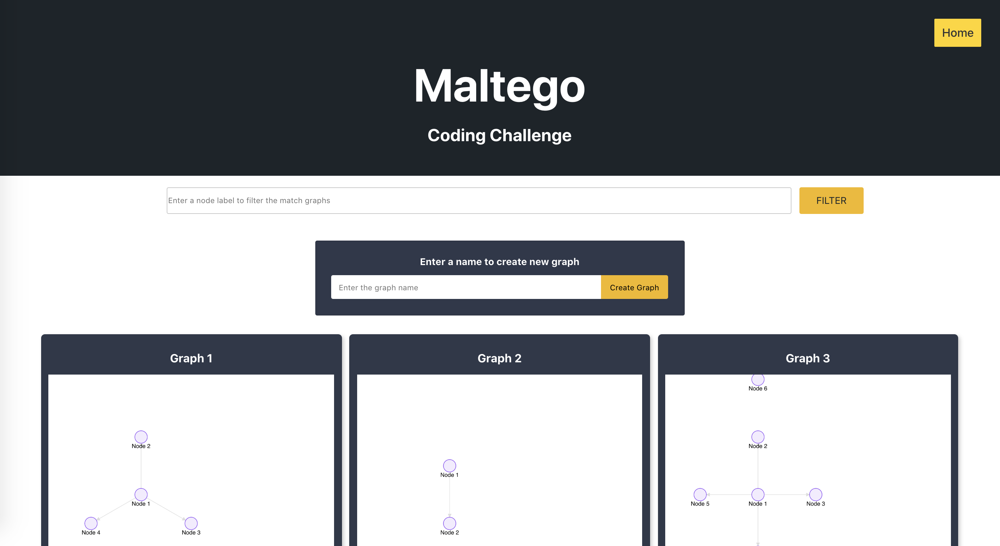
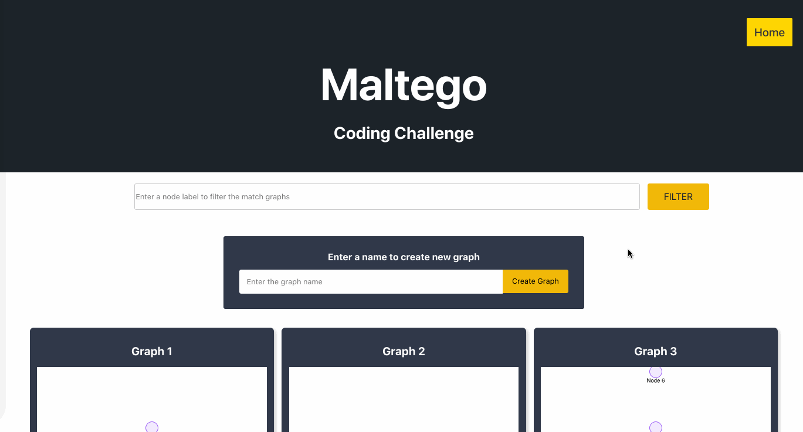
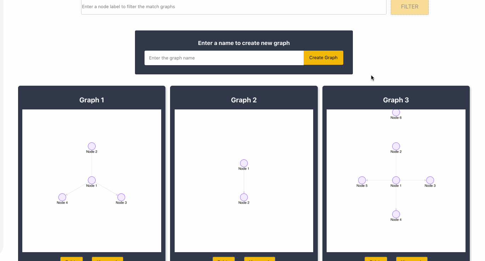
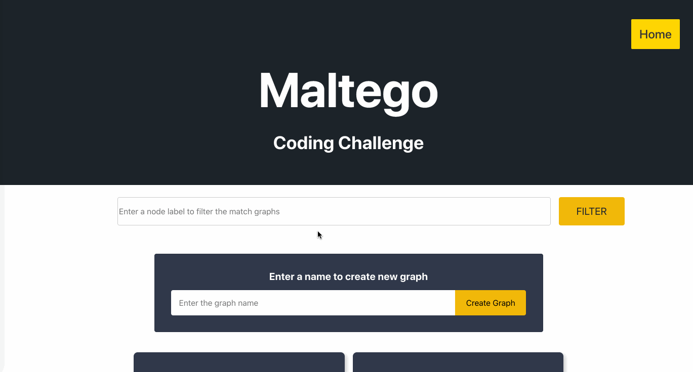
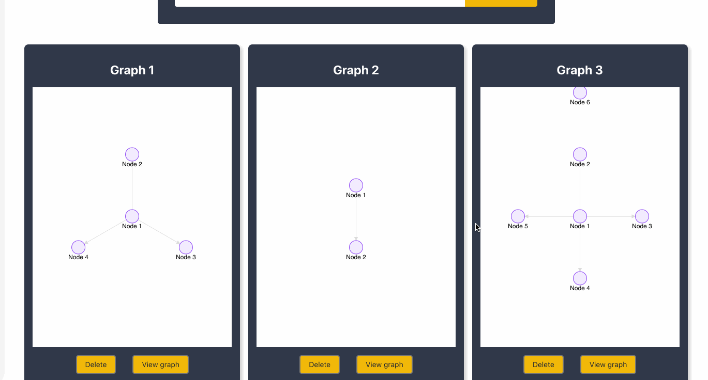

# Maltego Interview Challenge - Client

<!-- TABLE OF CONTENTS -->
<details open="open">
  <summary>Table of Contents</summary>
  <ol>
    <li>
      <a href="#about-the-project">About The Project</a>
      <ul>
        <li><a href="#built-with">Built With</a></li>
      </ul>
    </li>
    <li>
      <a href="#getting-started">Getting Started</a>
      <ul>
        <li><a href="#prerequisites">Prerequisites</a></li>
        <li><a href="#installation">Installation</a></li>
      </ul>
    </li>
    <li><a href="#usage">Usage</a></li>
    <li><a href="#contributing">Contributing</a></li>
    <li><a href="#contact">Contact</a></li>
  </ol>
</details>


<!-- ABOUT THE PROJECT -->
## About The Project



This application displays a list of graphs with functionalities of create, search, and delete.

### Built With

* [React](https://reactjs.org/)
* [Graphin](https://graphin.antv.vision/)
* [tachyons](https://tachyons.io/)
* [HTML](https://en.wikipedia.org/wiki/HTML)
* [Javascript](https://en.wikipedia.org/wiki/JavaScript)
* [CSS](https://en.wikipedia.org/wiki/CSS)


<!-- GETTING STARTED -->
## Getting Started

You could run this application by following below guideline

### Prerequisites

Please make sure you have npm installed with latest version in the environment.
* npm
  ```sh
  npm install npm@latest -g
  ```

### Installation

1. Clone the repo and move into the directory
   ```sh
   git clone https://github.com/ywchen-muc/maltego-client
   cd maltego-client
   ```
2. Install NPM packages
   ```sh
   npm install
   ```
3. Start the backend service locally
   ```sh
   npm start
   ```
4. Visit the service from browser
   ```sh
   http://localhost:3001/
   ```


<!-- USAGE EXAMPLES -->
## Usage

### 0. Data

   ```json
   [
       {
           "id": "grph_1",
           "name": "Graph 1",
           "data": {
               "nodes": [{
                   "id": "nd_1",
                   "label": "Node 1"
               }, {
                   "id": "nd_2",
                   "label": "Node 2"
               },{
                   "id": "nd_3",
                   "label": "Node 3"
               },{
                   "id": "nd_4",
                   "label": "Node 4"
               }],
               "edges": [{
                   "source": "nd_1",
                   "target": "nd_2"
               }, {
                   "source": "nd_1",
                   "target": "nd_3"
               }, {
                   "source": "nd_1",
                   "target": "nd_4"
               }]
           }
       },     {
           "id": "grph_2",
           "name": "Graph 2",
           "data": {
               "nodes": [{
                   "id": "nd_1",
                   "label": "Node 1"
               }, {
                   "id": "nd_2",
                   "label": "Node 2"
               }],
               "edges": [{
                   "source": "nd_1",
                   "target": "nd_2"
               }]
           }
       },     {
           "id": "grph_3",
           "name": "Graph 3",
           "data": {
               "nodes": [{
                   "id": "nd_1",
                   "label": "Node 1"
               }, {
                   "id": "nd_2",
                   "label": "Node 2"
               },{
                   "id": "nd_3",
                   "label": "Node 3"
               },{
                   "id": "nd_4",
                   "label": "Node 4"
               },{
                   "id": "nd_5",
                   "label": "Node 5"
               },{
                   "id": "nd_6",
                   "label": "Node 6"
               }],
               "edges": [{
                   "source": "nd_1",
                   "target": "nd_2"
               }, {
                   "source": "nd_1",
                   "target": "nd_3"
               }, {
                   "source": "nd_1",
                   "target": "nd_4"
               }, {
                   "source": "nd_1",
                   "target": "nd_5"
               }]
           }
       }
   ]
   ```


#### 1. Filter the collection of graphs based on graph label using a textbox input

You could filter the graph collections where the node label contains the input value
Example: Node 4 only exists in both Graph 1 and Graph 3


#### 2. Delete a graph

Easily delete a graph by clicking the delete button



#### 3. Create a new graph

You could create a graph by just entering the desired name. It will create a graph with empty data.



#### 4. View graph in force directed graph layout

You could zoom-in/out, drag canvas and nodes and click nodes to see its relationship




<!-- CONTRIBUTING -->
## Contributing

Contributions are what make the open source community such an amazing place to be learn, inspire, and create. Any contributions you make are **greatly appreciated**.

1. Fork the Project
2. Create your Feature Branch (`git checkout -b feature/amazingFeature`)
3. Commit your Changes (`git commit -m 'Add some amazing features'`)
4. Push to the Branch (`git push origin feature/amazingFeature`)
5. Open a Pull Request


<!-- CONTACT -->
## Contact 

Email: [imv2w.muc@gmail.com](mailto:imv2w.muc@gmail.com])

My website: [viviennechen.me](https://www.viviennechen.me/)

Project Link: [https://github.com/ywchen-muc/maltego-client](https://github.com/ywchen-muc/maltego-client)

